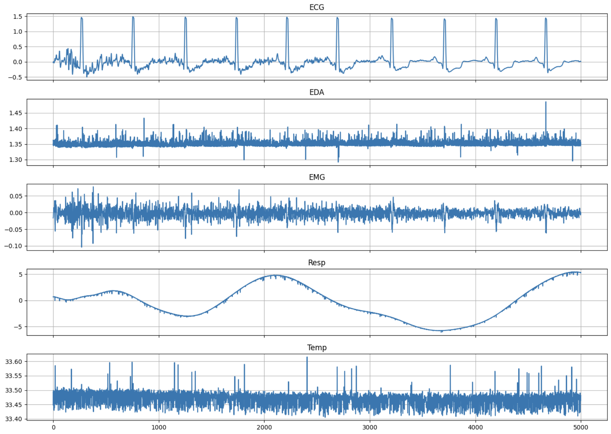
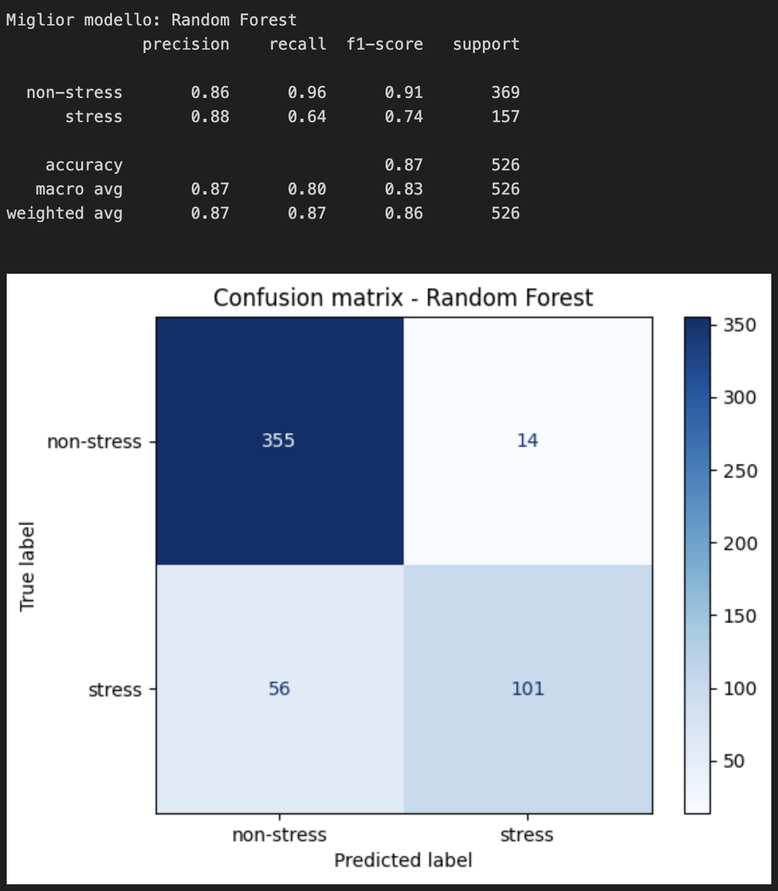
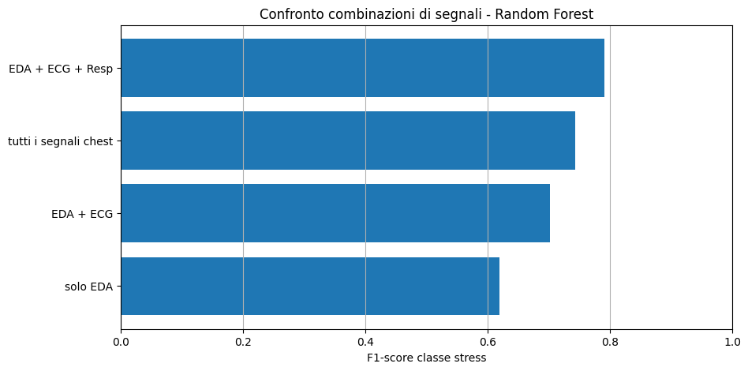

# WESAD Stress Detection

Progetto universitario per il riconoscimento automatico dello stress a partire da segnali fisiologici del dataset WESAD.

Obiettivo: caricare i dati, capire i segnali, trasformarli in feature numeriche, addestrare modelli di Machine Learning e valutare quanto riescono a distinguere situazioni di stress da situazioni di non stress.

## Dataset

Il progetto usa il dataset WESAD, disponibile su Kaggle come [WESAD full dataset](https://www.kaggle.com/datasets/mohamedasem318/wesad-full-dataset).

WESAD contiene registrazioni fisiologiche raccolte da piu' soggetti durante diverse condizioni sperimentali. In questo progetto sono state considerate tre condizioni principali:

- `baseline`: stato neutrale;
- `stress`: stato di stress;
- `amusement`: stato di divertimento.

Per la classificazione binaria abbiamo raggruppato le classi in questo modo:

- `stress`: label `2`;
- `non-stress`: label `1` baseline + label `3` amusement.

Le altre label presenti nel dataset sono state escluse per mantenere il progetto semplice e coerente con l'obiettivo principale.

## Segnali utilizzati

Abbiamo usato i segnali provenienti dal sensore `chest`, cioe' dal dispositivo indossato sul petto, perche' sono i piu' completi nel dataset WESAD e sono vicini alla pipeline del paper originale.

I segnali usati sono:

- `ECG`: attivita' cardiaca;
- `EDA`: attivita' elettrodermica, collegata alla sudorazione;
- `EMG`: attivita' muscolare;
- `Resp`: respirazione;
- `Temp`: temperatura corporea.

Il segnale `ACC` e i segnali `wrist` non sono stati usati nella pipeline principale.

## Struttura del progetto

```text
wesad-stress-detection/
  README.md
  docs/
    media/
      confronto_combinazioni.png
      confusion_matrix.png
      segnali.png
    references/
      WESAD dataset.pdf
  notebooks/
    01-dataset-exploration.ipynb
    02-feature-extraction.ipynb
    03-binary-classification.ipynb
    04-multiclass-and-comparison.ipynb
  data/
    processed/
      features_chest.csv
```

I dati originali WESAD non sono inclusi nel repository perche' sono pesanti. Nei notebook il dataset viene caricato da Kaggle.
Il file `data/processed/features_chest.csv` e' invece incluso per rendere replicabili i notebook di classificazione senza dover rieseguire ogni volta la feature extraction.

## Pipeline realizzata

Il lavoro e' stato diviso in quattro notebook.

### 1. Esplorazione del dataset

Notebook: `notebooks/01-dataset-exploration.ipynb`

In questo notebook abbiamo:

- caricato un file `.pkl` del dataset WESAD;
- controllato la struttura del dizionario Python;
- verificato la presenza dei segnali `chest` e `wrist`;
- osservato la dimensione dei segnali;
- studiato la distribuzione delle label;
- visualizzato alcuni segnali fisiologici.

Questa fase e' servita a capire come sono organizzati i dati e quali label usare nel progetto.



### 2. Feature extraction

Notebook: `notebooks/02-feature-extraction.ipynb`

I segnali fisiologici sono serie temporali molto lunghe, quindi non sono stati dati direttamente ai modelli. Li abbiamo trasformati in un dataset tabellare.

La procedura usata e':

- caricamento di tutti i soggetti disponibili;
- selezione dei segnali `ECG`, `EDA`, `EMG`, `Resp`, `Temp`;
- mantenimento solo delle label `1`, `2`, `3`;
- filtraggio dei segnali `EDA` e `Resp`, seguendo i filtri citati nel paper WESAD;
- divisione dei segnali in finestre da 60 secondi senza overlap;
- assegnazione della label prevalente a ogni finestra;
- calcolo di feature statistiche per ogni segnale.

Filtri applicati:

- `EDA`: filtro passa-basso a 5 Hz;
- `Resp`: filtro passa-banda 0.1-0.35 Hz.

I segnali `ECG`, `EMG` e `Temp` sono stati lasciati senza filtro esplicito, per evitare di introdurre parametri non direttamente indicati dal paper nella nostra pipeline semplificata.

Per ogni segnale sono state calcolate queste feature:

- media;
- deviazione standard;
- minimo;
- massimo;
- range;
- mediana.

Il dataset finale contiene:

- 15 soggetti;
- 526 finestre totali;
- 30 feature numeriche;
- label originale;
- label binaria;
- identificativo del soggetto.

Distribuzione delle classi nel dataset finale:

```text
non-stress: 369 finestre
stress:     157 finestre
```

## Modelli di Machine Learning

Notebook: `notebooks/03-binary-classification.ipynb`

Per il task principale `stress` vs `non-stress` abbiamo confrontato modelli classici e interpretabili:

- Logistic Regression;
- Decision Tree;
- Random Forest;
- k-Nearest Neighbors.

La validazione e' stata fatta con strategia `Leave-One-Subject-Out`: a ogni iterazione un soggetto viene lasciato fuori dal training e usato come test. Questa scelta e' importante perche' evita di testare il modello su finestre dello stesso soggetto viste durante l'addestramento.

## Risultati del task binario

Il modello migliore nel task `stress` vs `non-stress` e' stato Random Forest.

Risultati principali:

```text
Modello              Accuracy   Precision stress   Recall stress   F1 stress
Random Forest        0.867      0.878              0.643           0.743
Logistic Regression  0.793      0.624              0.771           0.689
Decision Tree        0.808      0.706              0.611           0.655
kNN                  0.819      0.878              0.459           0.603
```

Random Forest ha ottenuto la migliore combinazione tra accuratezza generale e F1-score sulla classe stress. Logistic Regression ha ottenuto la recall piu' alta sulla classe stress, ma con precisione piu' bassa.



## Analisi multiclass e confronto tra segnali

Notebook: `notebooks/04-multiclass-and-comparison.ipynb`

Nell'ultimo notebook abbiamo aggiunto due analisi:

1. classificazione a 3 classi: `baseline`, `stress`, `amusement`;
2. confronto tra diverse combinazioni di segnali per il task binario.

Nel task multiclass il risultato migliore e' stato ottenuto da Random Forest:

```text
Modello              Accuracy   Precision macro   Recall macro   F1 macro
Random Forest        0.736      0.643             0.611          0.614
Logistic Regression  0.631      0.585             0.603          0.588
Decision Tree        0.601      0.569             0.524          0.534
kNN                  0.608      0.553             0.484          0.499
```

Il task a 3 classi e' piu' difficile del task binario, perche' il modello deve distinguere non solo stress e non stress, ma anche separare baseline e amusement.

Nel confronto tra segnali, la combinazione migliore e' stata:

```text
EDA + ECG + Resp
```

Risultati del confronto:

```text
Segnali              Accuracy   Precision stress   Recall stress   F1 stress
EDA + ECG + Resp     0.880      0.826              0.758           0.791
Tutti i chest        0.867      0.878              0.643           0.743
EDA + ECG            0.831      0.739              0.669           0.702
Solo EDA             0.778      0.633              0.605           0.619
```

Questo mostra che EDA da sola contiene informazioni utili, ma combinarla con ECG e respirazione migliora chiaramente il riconoscimento dello stress.



## Confronto con il paper WESAD

Il progetto si ispira al paper originale WESAD, ma usa una pipeline semplificata per scopi didattici.

Differenze:

- feature statistiche semplici invece di feature fisiologiche piu' specializzate;
- filtraggio limitato ai segnali `EDA` e `Resp`, senza replicare tutto il preprocessing avanzato del paper;
- finestre da 60 secondi senza overlap;
- uso principale dei segnali chest selezionati;

Per questo motivo i risultati non devono essere interpretati come replica esatta del paper, ma come una versione semplificata e spiegabile della stessa idea di ricerca.

## Come eseguire il progetto

1. Scaricare o collegare il dataset WESAD da Kaggle.
2. Aprire i notebook in ordine.
3. Eseguire prima l'esplorazione del dataset.
4. Eseguire la feature extraction per generare il CSV delle feature.
5. Eseguire la classificazione binaria.
6. Eseguire l'analisi multiclass e il confronto tra segnali.

Poiche' `data/processed/features_chest.csv` e' gia' incluso nel repository, per controllare solo i risultati dei modelli e' possibile partire direttamente dal notebook `03-binary-classification.ipynb`.

Ordine consigliato:

```text
notebooks/01-dataset-exploration.ipynb
notebooks/02-feature-extraction.ipynb
notebooks/03-binary-classification.ipynb
notebooks/04-multiclass-and-comparison.ipynb
```

## Conclusione

Il progetto dimostra che i segnali fisiologici del dataset WESAD possono essere usati per riconoscere automaticamente lo stress tramite una pipeline di Machine Learning classica.

I risultati migliori sono stati ottenuti usando Random Forest per il task binario e combinando i segnali EDA, ECG e Resp nell'analisi dei sensori.

## Team

- Michele Viselli
- Elia Toschi
- Celestino Resteghini
- Matteo Franguelli
